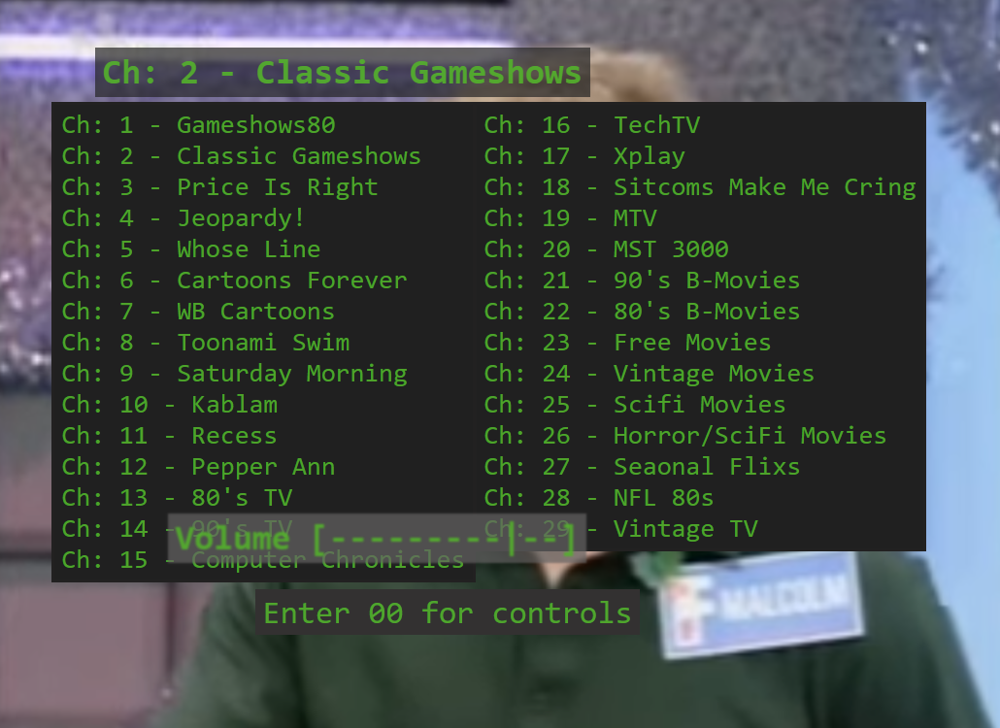

# TubeSim
## Description:  

Ever wish you could go back in time to the "good-old-days" of tube TV's, predetermined television programming and unskippable commercials? CRT Flash Back Machine is designed to fill this empty void and hit you with a healthy dose of nostalgia! View hundreds of vintage content from the past century on your favorite old CRT television! Sit back and let the good times roll!

This program is specifically designed for the use of a standard definition tube TV set.  It is recommened to run this program on a device such as the Raspberry Pi, but the minimum requirements are:

- Device capable of streaming videos in a web browser.
- Modern web browser with HTML5 support



## Installation
This code is designed to be run locally without the need for a server. Simply clone or download the repository and open ```index.html``` in your prefered browser to get started. 

There is a live link provided at the bottom of this README if you do not wish to download locally. For the best expiriance you MUST configure your browser to allow autoPlay. Due to the nature of this program, there is no user input to initiate the video player. The ultimate expiriance is had with a dedicated device that automatically boots into a web browser with this program as its home page running on a CRT TV.  

The channel names and associated youtube playlists can be customized by editing the ```channels.js``` file found in the ```src/data``` directory. Youtube limits embeded playlists to a maximum 200 videos. Each channel can contain an array of playlists to circumvent this limitation. The program will randomly select all videos in a single playlist before moving on the next sequential playlist.

## Features

- Plays random videos from slected channel
- Saves epsiodes that the user has watched so they do not repeat
- Can be controlled entirely by number keypad, allowing for use of wireless keypad as a simple remote
- Refreshing the page generates a new episode
- Skip episodes and/or remove it from random selection
- Overscan and horizintal/vertical shift control

## Future Features

- Add setting to allow channels to remember thier state after changing channels
- Add system menu UI for system settings

## Controls
| Key  |Action   |
| ------------ | ------------ |
|  + PgUp |   Channel Up |
|  - PgDwn|  Channel Down  |
| Number 0-9  |  Enter a channel  |
|  *  |Vol+|
|  / |Vol-|
|  . , | Display/Hide channels list |
|  F5/Insert | Reload Page for new random show  |
|Home| Pseudo power down|
|End| Skip episode forever|


## System Controls
|While channels list is open| |
|---------------|---------------|
|Input 99| Clears the Memory of the Current Channel|
|Input 98| Clears all Channel Memory|  
|CH+/Ch-| Increase/Decrease Overscan|
|Direction Keys| Horizontal/Vertical Shift|
|Delete| Toggle CRT filter|


## [link](https://chriskurz098.github.io/TubeSim/)
